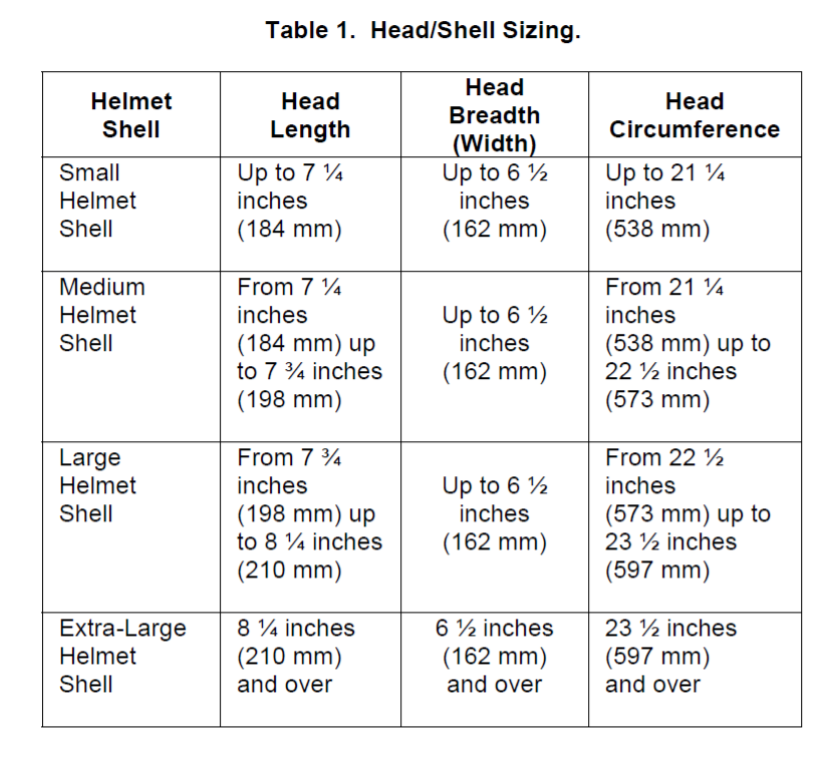

```{r setup, include=FALSE}
knitr::opts_chunk$set(echo = FALSE)
library(tidyverse)
library(hrbrthemes)
library(kableExtra)
library(ggplot2)
library(ggpubr)
library(nortest)
library(xtable)
require(modeest)
require(caret)

# Suppress summarise info
options(dplyr.summarise.inform = FALSE)
```

\newpage

# Uvod

U ovom projektu bavit ćemo se analizom antropometrijskih podataka američkih vojnih snaga (ANSUR_II). Podatci se sastoje od 6068 vojnika i 107 značajki sakupljenih od 2010 do 2012 u raznim američkim vojnim kampovima.

## Prikaz podataka
```{r}
# Učitavanje dataseta i pregled samo prvih nekoliko redaka
data <- read.csv("../data/ANSUR_II_data.csv");
data <- select(data, -c("X", "Date", "PrimaryMOS", "SubjectsBirthLocation", "SubjectNumericRace", "Ethnicity", "DODRace"));
df.transpose = t(data);
kable(df.transpose[,0:3], longtable = TRUE, booktab = T) %>% kable_styling(latex_options = c("repeat_header"));
```

\newpage
# Analiza vojnih kampova

## Priprema podataka

Prvo čemo provjeriti broj opažanja i udio spolova u kampovima.
\newline
```{r}
#Prebrojavanje osoba u kampovima
df.count = data %>% group_by(Installation) %>% count()
df.camps <- filter(data, data$Installation != "Fort Rucker")
df.count

#Udio spolova u kampovima
df.genderRatio = data %>% group_by(Installation) %>%
  summarize(pct.males = sum(Gender == "Male") * 100 / length(Gender),
            pct.female = 100 - pct.males)
df.genderRatio
```
\clearpage
\newpage
Prebrojavanjem vojnika u kampovima vidimo da se u kampu "Fort Rucker" nalazi samo jedna osoba, stoga taj kamp nećemo koristiti u našoj analizi.

Za analizu smo nasumično odabrali sljedeće atribute:

- duljina svoda stopala (balloffootlength)
- opseg prsa (chestcircumference)
- duljina ruke (handlength)
- širina kukova (hipbreadth)
- spol (Gender).

```{r}
df.camps <- df.camps[names(df.camps) %in% c("balloffootlength", "chestcircumference", "handlength", "hipbreadth", "Gender", "Installation")]
df.camps$Gender = factor(df.camps$Gender, levels = c("Male", "Female"), labels = c("Male", "Female"))

installations = unique(df.camps$Installation)
df.camps$Installation = factor(df.camps$Installation, levels = c(unlist(installations)), labels = c(unlist(installations)))

summary(df.camps)
```
\clearpage

```{r}
#Srednja vrijednost
df.mean <- df.camps %>% group_by(Installation) %>% summarise(
      mean.balloffootlength = mean(balloffootlength),
      mean.chestcircumference = mean(chestcircumference),
      mean.handlength = mean(handlength),
      mean.hipbreadth = mean(hipbreadth))
kable(df.mean, caption = "Srednja vrijednost pojedine mjere u zasebnom kampu")

#Medijan
df.med <- df.camps %>% group_by(Installation) %>% summarise(
      med.balloffootlength = median(balloffootlength),
      med.chestcircumference = median(chestcircumference),
      med.handlength = median(handlength),
      med.hipbreadth = median(hipbreadth))
kable(df.med, caption = "Medijan pojedine mjere u zasebnom kampu")

#Varijanca
df.var <- df.camps %>% group_by(Installation) %>% summarise(
      var.balloffootlength = var(balloffootlength),
      var.chestcircumference = var(chestcircumference),
      var.handlength = var(handlength),
      var.hipbreadth = var(hipbreadth))
kable(df.var, caption = "Varijanca pojedine mjere u zasebnom kampu")
```
\clearpage
Iz pregleda srednjih vrijednosti i medijana kampova, pošto su približno jednaki, možemo naslutiti na normalnu razdiobu vrijednosti. Također, ispisom varijance ne uočavamo veliko odstupanje u vrijednosti među kampovima, stoga, kako bi smo vidjeli imali li neke značajne razlike u antropometrijskim podatcima možemo provest jednofaktorski ANOVA model.

## Jednofaktorska ANOVA

Pretpostavke ANOVE su:

- nezavisnost pojedinih podataka u uzorcima
- normalna razdioba podataka
- homogenost varijanci među populacijama.

Podatci su neovisni pošto se radi o pojedinim osobama.

### Normalna razdioba

```{r echo = FALSE, results = FALSE}
captions = c("Histogram duljine svoda stopala",
             "Histogram opsega prsa", 
             "Histogram duljine ruke",
             "Histogram širine kukova")
```

```{r histogram, echo = FALSE, eval =T, fig.align = "center", fig.cap=captions, out.width='0.9\\linewidth', fig.ncol = 4}
#Histogrami
ggplot(data=df.camps, aes(x=balloffootlength, group=Installation, fill=Installation, color=Installation)) +
  geom_histogram(bins=30) +
  facet_wrap(~Installation) +
  theme(axis.text.x = element_text(angle=90, hjust=1)) +
  ylab("Observations") + xlab("Ball of foot length [mm]") 

ggplot(data=df.camps, aes(x=chestcircumference, group=Installation, fill=Installation, color=Installation)) +
  geom_histogram(bins=30) +
  facet_wrap(~Installation) +
  theme(axis.text.x = element_text(angle=90, hjust=1)) +
  ylab("Observations") + xlab("Chest circumference [mm]") 

ggplot(data=df.camps, aes(x=handlength, group=Installation, fill=Installation, color=Installation)) +
  geom_histogram(bins=30) +
  facet_wrap(~Installation) +
  theme(axis.text.x = element_text(angle=90, hjust=1)) +
  ylab("Observations") + xlab("Hand length [mm]") 

ggplot(data=df.camps, aes(x=hipbreadth, group=Installation, fill=Installation, color=Installation)) +
  geom_histogram(bins=30) +
  facet_wrap(~Installation) +
  theme(axis.text.x = element_text(angle=90, hjust=1)) +
  ylab("Observations") + xlab("Hip breadth [mm]") 
```
\clearpage
```{r fig.pos= 'H'}
#testiranje normalnosti lillieforsovom inačicom Kolmogorov-Smirnovovog test
lil = lillie.test(scale(df.camps$balloffootlength))

i <- 2
l.foot <- list()
l.foot[[1]] <- lil$p.value
for (camp in installations) {
  lil = lillie.test(scale(df.camps$balloffootlength[df.camps$Installation==camp]))
  l.foot[[i]] <- lil$p.value
  i <- i + 1
}

lil = lillie.test(scale(df.camps$chestcircumference))

i <- 2
l.chest <- list()
l.chest[[1]] <- lil$p.value
for (camp in installations) {
  lil = lillie.test(scale(df.camps$chestcircumference[df.camps$Installation==camp]))
  l.chest[[i]] <- lil$p.value
  i <- i + 1
}

lil = lillie.test(scale(df.camps$handlength))

i <- 2
l.hand <- list()
l.hand[[1]] <- lil$p.value
for (camp in installations) {
  lil = lillie.test(scale(df.camps$handlength[df.camps$Installation==camp]))
  l.hand[[i]] <- lil$p.value
  i <- i + 1
}

lil = lillie.test(scale(df.camps$hipbreadth))

i <- 2
l.hip <- list()
l.hip[[1]] <- lil$p.value
for (camp in installations) {
  lil = lillie.test(scale(df.camps$hipbreadth[df.camps$Installation==camp]))
  l.hip[[i]] <- lil$p.value
  i <- i + 1
}

df.pval <- data.frame("Installation" = c("Ungrouped", installations), "balloffootlength.p" = c(unlist(l.foot)), "chestcircumference.p" = c(unlist(l.chest)), 
                      "handlength.p" = c(unlist(l.hand)), "hipbreadth" = c(unlist(l.hip)), stringsAsFactors=FALSE)
kable(df.pval, caption = "P-vrijednosti Kolmogorov-Smirnovovog testa pojedinih vrijednosti u kampovima")
```

Testiranjem podataka na normalnost u večini slučajeva vidimo veoma visoke p-vrijednosti što uz određeni nivo značajnosti ukazuje na normalnost. P-vrijednosti negrupiranih pojedinih atributa bitno se razlikuju od grupiranih čime također možemo naslutiti na postojanje neke razlike među vojnim kampovima (uočavamo Simpsonov paradoks). Grafički prikaz podataka također nas navodi kako su podatci normalno distribuirani. 
\newpage

### Homogenost varijanci među populacijama

```{r echo = FALSE, results = FALSE}
captions = c("Boxplot-ovi duljine svoda stopala",
             "Boxplot-ovi opsega prsa", 
             "Boxplot-ovi duljine ruke",
             "Boxplot-ovi širine kukova")
```

```{r boxplot 2, echo = FALSE, eval =T, fig.align = "center", fig.cap=captions, out.width='0.9\\linewidth', fig.ncol = 4}
#boxplottovi podataka po kampovima
ggplot(df.camps, aes(Installation, balloffootlength)) + 
  geom_boxplot() +
  theme(axis.text.x = element_text(angle=90, hjust=1)) +
  xlab("Installations") + ylab("Ball of foot length [mm]") 

ggplot(df.camps, aes(Installation, chestcircumference)) + 
  geom_boxplot() +
  theme(axis.text.x = element_text(angle=90, hjust=1)) +
  xlab("Installations") + ylab("Chest circumference [mm]") 

ggplot(df.camps, aes(Installation, handlength)) + 
  geom_boxplot()+
  theme(axis.text.x = element_text(angle=90, hjust=1)) +
  xlab("Installations") + ylab("Hand length [mm]") 

ggplot(df.camps, aes(Installation, hipbreadth)) + 
  geom_boxplot() +
  theme(axis.text.x = element_text(angle=90, hjust=1)) +
  xlab("Installations") + ylab("Hip breadth [mm]") 
```
\clearpage

### Bartlettov test homogenosti varijance
```{r}
#ispitivanje homogenosti varijanci
bartlett.test(df.camps$balloffootlength ~ df.camps$Installation)
bartlett.test(df.camps$chestcircumference ~ df.camps$Installation)
bartlett.test(df.camps$handlength ~ df.camps$Installation)
bartlett.test(df.camps$hipbreadth ~ df.camps$Installation)
```
Iako Bartlettov test homogenosti varijanci ne daje povoljne p-vrijednosti, pošto se naše varijance ne razlikuju za veću dimenziju, provest ćemo ANOV-u.

\newpage
### Provođenje ANOVA-e

```{r}
#anova
a = aov(df.camps$balloffootlength ~ df.camps$Installation)
summary(a)

a = aov(df.camps$chestcircumference ~ df.camps$Installation)
summary(a)

a = aov(df.camps$handlength ~ df.camps$Installation)
summary(a)

a = aov(df.camps$hipbreadth ~ df.camps$Installation)
summary(a)
```
Provođenjem ANOVA-e uz beznačajno male p-vrijednosti zaključujemo kako postoji bitna razlika u varijancama antropometrijskih podataka pojedinog vojnog kampa.

\newpage
## Dvofaktorska ANOVA

Iz boxplot-a nekih antropometrijskih podataka možemo vidjeti znatno odskakanje srednje vrijednosti kampa "Fort Lee". Nadalje, iz tablice udjela spolova u kampovima vidljivo je da u kampu "Fort Lee" nema opažanja muških vojnika. Stoga provodimo dvofaktorsku ANOVA-u s faktorima spola i kampa.

```{r echo = FALSE, results = FALSE}
captions = c("Boxplot-ovi duljine svoda stopala po spolovima",
             "Boxplot-ovi opsega prsa po spolovima", 
             "Boxplot-ovi duljine ruke po spolovima",
             "Boxplot-ovi širine kukova po spolovima")
```

```{r boxplot 3, echo = FALSE, eval =T, fig.align = "center", fig.cap=captions, out.width='0.9\\linewidth', fig.ncol = 4}
ggplot(df.camps, aes(Gender, balloffootlength)) + 
  geom_boxplot() +
  theme(axis.text.x = element_text(angle=90, hjust=1)) +
  xlab("Gender") + ylab("Ball of foot length [mm]") 

ggplot(df.camps, aes(Gender, chestcircumference)) + 
  geom_boxplot() +
  theme(axis.text.x = element_text(angle=90, hjust=1)) +
  xlab("Gender") + ylab("Chest circumference [mm]") 

ggplot(df.camps, aes(Gender, handlength)) + 
  geom_boxplot()+
  theme(axis.text.x = element_text(angle=90, hjust=1)) +
  xlab("Gender") + ylab("Hand length [mm]") 

ggplot(df.camps, aes(Gender, hipbreadth)) + 
  geom_boxplot() +
  theme(axis.text.x = element_text(angle=90, hjust=1)) +
  xlab("Gender") + ylab("Hip breadth [mm]") 
```
\clearpage
```{r echo = FALSE, results = FALSE}
captions = c("Boxplot-ovi duljine svoda stopala [Installation, Gender]",
             "Boxplot-ovi opsega prsa po spolovima [Installation, Gender]", 
             "Boxplot-ovi duljine ruke po spolovima [Installation, Gender]",
             "Boxplot-ovi širine kukova po spolovima [Installation, Gender]")
```

```{r boxplot, echo = FALSE, eval =T, fig.align = "center", fig.cap=captions, out.width='0.9\\linewidth', fig.ncol = 4}
inter = interaction(df.camps$Installation, df.camps$Gender)
boxplot(df.camps$balloffootlength ~ inter,cex.axis=0.5, xlab = "Installation, Gender", ylab = "Ball of foot length [mm]")

boxplot(df.camps$chestcircumference ~ inter,cex.axis=0.5, xlab = "Installation, Gender", ylab = "Chest circumference [mm]")

boxplot(df.camps$handlength ~ inter,cex.axis=0.5, xlab = "Installation, Gender", ylab = "Hand length [mm]")

boxplot(df.camps$hipbreadth ~ inter,cex.axis=0.5, xlab = "Installation, Gender", ylab = "Hip breadth [mm]")
```
\clearpage
Iz boxplotova vidljiva je znatna razlika u srednjoj vrijednosti po spolovima. 

### Bartlettov test homogenosti varijance
```{r}
#test varijance
bartlett.test(df.camps$balloffootlength ~ inter)
bartlett.test(df.camps$chestcircumference ~ inter)
bartlett.test(df.camps$handlength ~ inter)
bartlett.test(df.camps$hipbreadth ~ inter)
```

### Provođenje ANOVA-e
```{r}
#anova
a = aov(balloffootlength ~ Installation * Gender, data = df.camps)
summary(a)

a = aov(chestcircumference ~ Installation * Gender, data = df.camps)
summary(a)

a = aov(handlength ~ Installation * Gender, data = df.camps)
summary(a)

a = aov(hipbreadth ~ Installation * Gender, data = df.camps)
summary(a)
```

## Zaključak

Provođenjem jednofaktorske ANOVA-e zaključili smo kako postoji značajna razlika u antropometrijskim podacima populacija vojnih kampova. Daljnjom analizom grafički smo prikazali kako faktor spola utječe na neke antropometrijske mjere kao što su duljina ruke ili opseg prsa, ali iako je faktor spola podjelio podatke u njihovim srednjim vrijednostima, temeljem dvofaktorske ANOVA-e zaključili smo da još uvijek postoji značajna razlika u varijanci promatranih antropometrijskih podataka između istospolnih populacija kampova.   


\newpage
# Predviđanje kilaže vojnika 

Kako bismo mogli predvidjeti kilažu vojnika, ispitat ćemo različite varijable koje bi mogle utjecati na nju:  
  
- visina
- opseg struka
- opseg vrata
- duljina prednjeg struka u sjedećem položaju 
- opseg bedra

## Jednostavna regresija
```{r echo = FALSE, results = FALSE}
captions = c("Utjecaj visine na kilažu",
              "Utjecaj opsega struka na kilažu", 
              "Utjecaj opsega vrata na kilažu",
              "Utjecaj duljine prednjeg struka u sjedećem položaju na kilažu",
              "Utjecaj opsega bedra na kilažu")
```

```{r scatter plots, echo = FALSE, eval =T, fig.cap=captions, out.width='0.9\\linewidth', fig.ncol = 2}
ggplot(data, aes(x = stature, y = weightkg)) +
  geom_point() + geom_smooth(method = "gam", formula = y ~ s(x, bs = "cs")) +
  xlab("Stature  [mm]") + ylab("Weight  [hg]") 

ggplot(data, aes(x = waistcircumference, y = weightkg)) +
  geom_point() + geom_smooth(method = "gam", formula = y ~ s(x, bs = "cs")) + 
  xlab("Waist circumference  [mm]") + ylab("Weight  [hg]")

ggplot(data, aes(x = neckcircumference, y = weightkg)) +
  geom_point() + geom_smooth(method = "gam", formula = y ~ s(x, bs = "cs")) + 
  xlab("Neck circumference  [mm]") + ylab("Weight  [hg]") 

ggplot(data, aes(x = waistfrontlengthsitting, y = weightkg)) +
  geom_point() + geom_smooth(method = "gam", formula = y ~ s(x, bs = "cs")) + 
  xlab("Front waist length sitting  [mm]") + ylab("Weight  [hg]")

ggplot(data, aes(x = thighcircumference, y = weightkg)) +
  geom_point() + geom_smooth(method = "gam", formula = y ~ s(x, bs = "cs")) + 
  xlab("Thigh circumference  [mm]") + ylab("Weight  [hg]") 

```
\clearpage
Iz grafičkih prikaza vidi se da sve navedene varijable imaju pozitivan utjecaj na izlaznu varijablu kilaže. Najizraženiji je utjecaj opsega struka.

Kako bismo mogli ispitati pojedinačni utjecaj varijabli, procijenit ćemo model jednostavne regresije u kojem su navedenih pet varijabli (svaka u zasebnom modelu) nezavisne, a kilaža zavisna varijabla.
\newline
\newline
```{r echo = FALSE, results=FALSE}
captions1 = c("Linearni model kilaže i visine",
              "Linearni model kilaže i opsega struka", 
              "Linearni model kilaže i opsega vrata",
              "Linearni model kilaže i duljine prednjeg struka u sjedećem položaju",
              "Linearni model kilaže i opsega bedra")
```

```{r jednostavna regresija, echo=FALSE, eval =T, fig.cap=captions1, out.width='0.9\\linewidth', fig.ncol = 2}

fit.stature = lm(weightkg~stature, data = data) 
fit.waistcircumference = lm(weightkg~waistcircumference, data = data)
fit.neckcircumference = lm(weightkg~neckcircumference, data = data) 
fit.waistfrontlengthsitting = lm(weightkg~waistfrontlengthsitting, data = data) 
fit.thighcircumference = lm(weightkg~thighcircumference, data = data) 

ggplot(data, aes(stature, weightkg)) +
  geom_point() +
  stat_smooth(method = lm, formula = y ~ x, col='red', size = 1.2) +
   xlab("Stature  [mm]") + ylab("Weight  [hg]") 

ggplot(data, aes(waistcircumference, weightkg)) +
  geom_point() +
  stat_smooth(method = lm, formula = y ~ x, col='red', size = 1.2) + 
  xlab("Waist circumference  [mm]") + ylab("Weight  [hg]")

ggplot(data, aes(neckcircumference, weightkg)) +
  geom_point() +
  stat_smooth(method = lm, formula = y ~ x, col='red', size = 1.2) + 
  xlab("Neck circumference  [mm]") + ylab("Weight  [hg]") 

ggplot(data, aes(waistfrontlengthsitting, weightkg)) +
  geom_point() +
  stat_smooth(method = lm, formula = y ~ x, col='red', size = 1.2)  + 
  xlab("Front waist length sitting  [mm]") + ylab("Weight  [hg]")

ggplot(data, aes(thighcircumference, weightkg)) +
  geom_point() +
  stat_smooth(method = lm, formula = y ~ x, col='red', size = 1.2) + 
  xlab("Thigh circumference  [mm]") + ylab("Weight  [hg]") 

```
\clearpage
Nagibi pravaca linearne regresije potvrđuju tvrdnje o izraženom utjecaju razmatranih varijabli na kilažu vojnika. Kako bi se dobiveni modeli analizirali i usporedili, potrebno je provjeriti da pretpostavke modela o regresorima i rezidualima nisu narušene. Mora vrijediti normalnost reziduala i homogenost varijance i regresori u višestrukoj regresiji ne smiju biti međusobno jako korelirani.

### Normalnost reziduala i homogenost varijance  

Normalnost reziduala provjerit ćemo grafički te statistički pomoću Lillieforsove inačice Kolmogorov-Smirnovljevog testa.

\textbf{Visina:  } 

```{r echo = FALSE, results=FALSE}
captions2 = c("Histogram reziduala modela kilaže i visine",
              "Prikaz q-q  plota reziduala modela kilaže i visine s linijom normalne distribucije", 
              "Reziduali modela kilaže i visine u ovisnosti o procjenama modela")
```

```{r res1, echo= FALSE, fig.align= 'center', fig.pos= 'H', eval =T, fig.cap=captions2, out.width='0.7\\linewidth', fig.ncol = 2}

hist((fit.stature$residuals), col = 'lightblue'
     , main = 'Histogram of weight and stature LM residuals',
      xlab = 'LM residuals (weightkg~stature)')

qqnorm(rstandard(fit.stature))
qqline(rstandard(fit.stature))

plot(fit.stature$fitted.values,fit.stature$residuals)

#test na normalnost
lillie.test(rstandard(fit.stature))
```
\clearpage
\textbf{Opseg struka:  } 

```{r echo = FALSE, results=FALSE}
captions3 = c("Histogram reziduala modela kilaže i opsega struka",
              "Prikaz q-q plota reziduala modela kilaže i opsega struka s linijom normalne distribucije", 
              "Reziduali modela kilaže i opsega struka u ovisnosti o procjenama modela")
```

```{r res2, echo= FALSE, fig.align= 'center', fig.pos= 'H', eval =T, fig.cap=captions3, out.width='0.7\\linewidth', fig.ncol = 2}

hist((fit.waistcircumference$residuals),  col = 'lightblue'
     , main = 'Histogram of weight and waist circumference LM residuals',
      xlab = 'LM residuals (weightkg~waistcircumference)')

qqnorm(rstandard(fit.waistcircumference))
qqline(rstandard(fit.waistcircumference))

plot(fit.waistcircumference$fitted.values,fit.waistcircumference$residuals)

#KS test na normalnost 
lillie.test(rstandard(fit.waistcircumference))
```
\clearpage
\textbf{Opseg vrata:  } 

```{r echo = FALSE, results=FALSE}
captions4 = c("Histogram reziduala modela kilaže i opsega vrata",
              "Prikaz q-q plota reziduala modela kilaže i opsega vrata s linijom normalne distribucije", 
              "Reziduali modela kilaže i opsega vrata u ovisnosti o procjenama modela")
```

```{r res3, echo= FALSE, fig.align= 'center', fig.pos= 'H', eval =T, fig.cap=captions4, out.width='0.7\\linewidth', fig.ncol = 2}

hist((fit.neckcircumference$residuals),  col = 'lightblue'
     , main = 'Histogram of weight and neck circumference LM residuals',
      xlab = 'LM residuals (weightkg~neckcircumference)')

qqnorm(rstandard(fit.neckcircumference))
qqline(rstandard(fit.neckcircumference))

plot(fit.neckcircumference$fitted.values,fit.neckcircumference$residuals)

#KS test na normalnost 
lillie.test(rstandard(fit.neckcircumference))
```
\clearpage
\textbf{Duljina prednjeg struka u sjedećem položaju:  }

```{r echo = FALSE, results=FALSE}
captions5 = c("Histogram reziduala modela kilaže i duljine prednjeg struka u sjedećem položaju",
              "Prikaz q-q plota reziduala modela kilaže i duljine prednjeg struka u sjedećem položaju s linijom normalne distribucije", 
              "Reziduali modela kilaže i duljine prednjeg struka u sjedećem položaju u ovisnosti o procjenama modela")
```

```{r res4, echo= FALSE, fig.align= 'center', fig.pos= 'H', eval =T, fig.cap=captions5, out.width='0.7\\linewidth', fig.ncol = 2}

hist((fit.waistfrontlengthsitting$residuals),  col = 'lightblue'
     , main = 'Histogram of weight and front waist length sitting LM residuals',
      xlab = 'LM residuals (weightkg~waistfrontlengthsitting)')

qqnorm(rstandard(fit.waistfrontlengthsitting))
qqline(rstandard(fit.waistfrontlengthsitting))

plot(fit.waistfrontlengthsitting$fitted.values,fit.waistfrontlengthsitting$residuals)

#KS test na normalnost 
lillie.test(rstandard(fit.waistfrontlengthsitting))
```

\clearpage
\textbf{Opseg bedra:  } 

```{r echo = FALSE, results=FALSE}
captions6 = c("Histogram reziduala modela kilaže i opsega bedra",
              "Prikaz q-q plota reziduala modela kilaže i opsega bedra s linijom normalne distribucije", 
              "Reziduali modela kilaže i opsega bedra u ovisnosti o procjenama modela")
```

```{r res5, echo= FALSE, fig.align= 'center', fig.pos= 'H', eval =T, fig.cap=captions6, out.width='0.7\\linewidth', fig.ncol = 2}

hist((fit.thighcircumference$residuals),  col = 'lightblue'
     , main = 'Histogram of weight and thigh circumference LM residuals',
      xlab = 'LM residuals (weightkg~thighcircumference)')

qqnorm(rstandard(fit.thighcircumference))
qqline(rstandard(fit.thighcircumference))

plot(fit.thighcircumference$fitted.values, fit.thighcircumference$residuals)

#KS test na normalnost 
lillie.test(rstandard(fit.thighcircumference))
```

Rezultati Kolmogorov-Smirnovljevog testa daju, osim u slučaju modela kilaže i opsega struka, male p-vrijednosti. No, budući da reziduali ne pokazuju preveliko odstupanje od normalnosti i da je t-test je robustan na normalnost, u analizi podataka se i dalje mogu donositi statistički zaključci iz regresijskih modela.

### Ocjena kvalitete linearnog modela i statističko zaključivanje o procijenjenom modelu

```{r}
summary(fit.stature)
```
\noindent\rule{\textwidth}{1pt}
```{r}
summary(fit.waistcircumference)
```
\noindent\rule{\textwidth}{1pt}
```{r}
summary(fit.neckcircumference)
```
\noindent\rule{\textwidth}{1pt}
```{r}
summary(fit.waistfrontlengthsitting)
```
\noindent\rule{\textwidth}{1pt}
```{r}
summary(fit.thighcircumference)
```
\noindent\rule{\textwidth}{1pt}
\newline

Kao što je bilo vidljivo iz grafičkih prikaza, opseg struka ima izražen utjecaj na kilažu vojnika i objašnjava najveći postotak varijance (najveća vrijednost $R^2$). Također, u svim slučajevima koeficijenti uz nezavisnu varijablu su značajni, te F-testovi upućuju na to i da su svi modeli značajni. 
\bigskip    

### Korelacijski koeficijenti u linearnom modelu

```{r}
values = data.frame(data$stature, data$waistcircumference, data$neckcircumference, data$waistfrontlengthsitting, data$thighcircumference)

mcor<-round(cor(values, data$weightkg), 2)
mcor
```
\smallskip
Korelacijski koeficijenti potvrđuju da je utjecaj opsega struka na kilažu najizraženiji, a jak utjecaj imaju i opseg vrata kao i opseg bedra. Visina ima nešto manji, ali ipak značajan utjecaj.   
\clearpage    
   
## Višestruka regresija

Najprije je potrebno odabrati podskup varijabli koje nisu previše međusobno korelirane.

```{r correlation}
mcorrelation <-round(cor(values), 2)

colnames(mcorrelation) = c("stature", "waist circumference", "neck circumference", "front waist length sitting", "thigh circumference")
rownames(mcorrelation) = colnames(mcorrelation)

upper<-mcorrelation
upper[upper.tri(mcorrelation)]<-""
upper<-as.data.frame(upper)

kable(upper) %>%
  kable_styling(latex_options = c("scale_down"))
```
```{r}
fit.multi = lm(weightkg ~ waistcircumference + stature + waistfrontlengthsitting + neckcircumference + thighcircumference, data)
summary(fit.multi)
```
\noindent\rule{\textwidth}{1pt}
```{r}
fit.multi1 = lm(weightkg ~ waistcircumference + stature + waistfrontlengthsitting + neckcircumference, data)
summary(fit.multi1)
```
\noindent\rule{\textwidth}{1pt}
```{r}
fit.multi1 = lm(weightkg ~ stature + waistfrontlengthsitting + neckcircumference + thighcircumference, data)
summary(fit.multi1)
```
\noindent\rule{\textwidth}{1pt}
Model višestruke regresije koji uključuje sve varijable objašnjava cca. $97\%$ varijance u podatcima.

```{r echo = FALSE, results=FALSE}
captions7 = c("Histogram reziduala modela višestruke regresije",
              "Prikaz q-q plota reziduala model višestruke regresije", 
              "Reziduali modela višestruke regresije")
```
\newpage
### Provjera normalnosti reziduala  
  
```{r residuali - visestruka regresija, echo= FALSE, fig.align= 'center', fig.pos= 'H', eval =T, fig.cap=captions7, out.width='0.7\\linewidth', fig.ncol = 2}

hist((fit.multi$residuals),  col = 'lightblue'
     , main = 'Histogram of multiple linear regression residuals',
      xlab = 'multiple linear regression residuals')

qqnorm(rstandard(fit.multi))
qqline(rstandard(fit.multi))

plot(fit.multi$fitted.values,fit.multi$residuals) #reziduali u ovisnosti o procjenama modela

lillie.test(rstandard(fit.multi))

```

Iz grafičkih prikaza vidi se da reziduali ne pokazuju preveliko odstupanje od normalnosti i u analizi podataka se i dalje mogu donositi statistički zaključci iz regresijskog modela.
\newpage 

### Uključivanje kategorijskih varijabli

Kao regresor možemo uključiti i kategorijske varijable poput spola vojnika.
```{r kategorijske ulazne varijable, echo= FALSE, fig.align= 'center', fig.pos= 'H', eval =T, fig.cap=c('Kvadratni dijagram ovisnosti kilaže i spola'), out.width='0.7\\linewidth', fig.ncol = 2}

boxplot(weightkg~Gender, data) 

require(fastDummies)
data.d = dummy_cols(data,select_columns='Gender')

#procjena modela s varijablom Gender
fit.multi.d = lm(weightkg ~ waistcircumference + stature + waistfrontlengthsitting + neckcircumference + thighcircumference + Gender_Female, data.d)
summary(fit.multi.d)
```
\noindent\rule{\textwidth}{1pt}
```{r}
#procjena modela bez varijable Gender
summary(fit.multi)
```

### Zaključak

Model koji uz svih pet navednih numeričkih varijabli uključuje i spol vojnika, daje nešto veći $R^2$. Međutim, ako pogledamo prilagođeni koeficijent determinacije $R_{adj}^2$ koji penalizira dodatne parametre u modelu, vidimo da su isti za oba modela, što znači da varijabla spola nije toliko korisna i radi jednostavnosti ju možemo izbaciti.

\newpage
# Opseg bicepsa

## Prikaz raspodjele vojnika ovisno o preferenciji ruke i spolu 
```{r}
# Prikaz podataka za preferenciju ruke vojnikinja i vojnika
head(data[, c("bicepscircumferenceflexed", "WritingPreference")])
# All soldiers
table(data$WritingPreference)
barplot(table(data$WritingPreference),ylab = 'Frequency', main='Barplot of Soldiers Writing Preference Distribution',col='light green')
fem_write<-table(data$WritingPreference[data$Gender=='Female'])
# Female soldiers
fem_write
barplot(fem_write,ylab = 'Frequency', main='Barplot of Female Soldiers Writing Preference Distribution',col='light pink')
male_write<-table(data$WritingPreference[data$Gender=='Male'])
#Male soldiers
male_write
barplot(male_write,ylab = 'Frequency', main='Barplot of Male Soldiers Writing Preference Distribution',col='light blue')
```

## Test o dvije proporcije: dva uzorka

### Udio ljevaka ovisno o spolu

Želimo testirati hipotezu je li udio ljevakinja u odnosu na vojnikinje jednak udjelu ljevaka u odnosu na vojnike.

```{r}
prop.test(x = c(190, 466), n = c(1986, 3682),alternative = "less")

```
Zbog jako male p-vrijednosti od 0.0003075 možemo odbaciti $H_0$ hipotezu o jednakosti udjela  u korist $H_1$, odnosno možemo reći da je udio ljevakinja u ženskoj populaciji manji nego udio ljevaka u muškoj.

U 1940-ima znanstvenici su primjetili tu zanimljivu pojavu, a ona glasi da su žene rjeđe ljevakinje od muškaraca. Nisu sve studije zabilježile ovakve rezultate, ali daljnjim istraživanjem (od 2008. pa nadalje) ispostavilo se stvarno da je udio ljevakinja u ženskoj populaciji manji od udjela ljevaka u muškoj. Razlozi zašto je to tako još moraju biti istraženi, ali svakako je zanimljivo da se i u ovom datasetu vidi ta pojava.

## Opseg bicepsa ovisno o preferenciji ruke

```{r}

# Ispis minimalne, maksimalne i srednje vrijednosti te medijana, prvog i trećeg kvartila opsega desnog bicepsa
summary(data[, c("bicepscircumferenceflexed")])

```
Prikaz boxplota i prosječnih opsega desnog bicepsa za svaku promatranu skupinu(dešnjaka, ljevaka i ambidekstrenih vojnika).

```{r}
right=data[data$WritingPreference=='Right hand',]
left=data[data$WritingPreference=='Left hand',]
ambi=data[data$WritingPreference=='Either hand (No preference)',]

cat('Prosječni opseg desnog bicepsa dešnjaka ', mean(right$bicepscircumferenceflexed),'\n')
cat('Prosječna opseg desnog bicepsa ljevaka ', mean(left$bicepscircumferenceflexed), '\n')
cat('Prosječna opseg desnog bicepsa ambidekstrenih vojnika ', mean(ambi$bicepscircumferenceflexed), '\n')

boxplot(right$bicepscircumferenceflexed, left$bicepscircumferenceflexed, ambi$bicepscircumferenceflexed,
        names = c('Right handed','Left handed', 'Ambidextrous'),
        main='Boxplot of Writing preference soldiers biceps circumferences')
```
Želimo provjeriti imaju li vojnici dešnjaci veći opseg desnog bicepsa od vojnika ljevaka.Isto tako kasnije ćemo provjeriti imaju li vojnici dešnjaci veći opseg od ambidekstrenih vojnika.

Koristit ćemo neupareni t-test. Kako bi mogli provesti test, moramo najprije provjeriti pretpostavke normalnosti i nezavisnosti uzorka.

S obzirom kako je odabrana cijela populacija jedne baze iz koje promatramo ljevake i dešnjake i jer baza broji puno vise od 30 članova smatramo kako su promatrani uzorci nezavisni. Iz istih razloga su nezavisni za dešnjake i ambidekstrene vojnike.

### Opseg desnog bicepsa dešnjaka i ljevaka

#### Provjera normalnosti podataka

Sljedeći korak je provjeriti normalnost podataka koju najčešće provjeravamo: histgoramom, qq-plotom te KS-testom (kojim provjeravamo pripadnost podataka distribuciji).

```{r}


hist(right$bicepscircumferenceflexed, 
     breaks=20,
     main='Histogram of biceps circumference of right handed soldiers',
     xlab='Circumference in mm',col='light salmon')
hist(left$bicepscircumferenceflexed, 
     breaks=25,
     main='Histogram of biceps circumference of left handed soldiers',
     xlab='Circumference in mm',col='slate blue1')
hist(ambi$bicepscircumferenceflexed, 
     breaks=10,
     main='Histogram of biceps circumference of ambidextrous soldiers',
     xlab='Circumference in mm',col='darkolivegreen1')

qqnorm(right$bicepscircumferenceflexed, pch = 1, frame = FALSE,main='Right handed soldiers')
qqline(right$bicepscircumferenceflexed, col = "steelblue", lwd = 2)

qqnorm(left$bicepscircumferenceflexed, pch = 1, frame = FALSE,main='Left handed soldiers')
qqline(left$bicepscircumferenceflexed, col = "steelblue", lwd = 2)

qqnorm(ambi$bicepscircumferenceflexed, pch = 1, frame = FALSE,main='Ambidextrous soldiers')
qqline(ambi$bicepscircumferenceflexed, col = "steelblue", lwd = 2)

lillie.test(scale(right$bicepscircumferenceflexed))
lillie.test(scale(left$bicepscircumferenceflexed,))
lillie.test(scale(ambi$bicepscircumferenceflexed))
```
Histogrami upućuju na normalnost podataka kao i qq-plotovi.

Pod uvjetom da podatci zadovoljavaju sve pretpostavke možemo nastaviti sa t-testom kako bi ispitali imaju li dešnjaci veći opseg desnog bicepsa od ljevaka.

Kakve su varijance danih uzoraka?

```{r}
var(right$bicepscircumferenceflexed)
var(left$bicepscircumferenceflexed)
```
Jesu li varijance značajno različite? To ćemo ispitati testom o jednakosti varijanci.

#### Test o jednakosti varijanci
Ako imamo dva nezavisna slučajna uzorka koji dolaze iz normalnih distribucija , tada slučajna varijabla
ima Fisherovu distribuciju.
```{r}
var.test(right$bicepscircumferenceflexed, left$bicepscircumferenceflexed)
```
p-vrijednost od 0.6708 nam govori da ne možemo odbaciti hipotezu $H_0$ da su varijance naša dva uzorka jednake.

#### t-test uz pretpostavku jednakosti varijanci

$H_0$ prosječne vrijednosti opsega desnog bicepsa vojnika dešnjaka i vojnika ljevaka  su jednake\newline
$H_1$ prosječne vrijednosti opsega desnog bicepsa dešnjaka vojnika i ljevaka vojnika su različite (tj. dešnjaci vojnici imaju u prosjeku veći desni biceps od vojnika ljevaka).

```{r}
# Bitan je poredak kojim funkciji 't.test()' prosljedjujemo uzorke!
t.test(right$bicepscircumferenceflexed, left$bicepscircumferenceflexed, alt = "greater", var.equal = TRUE)
```
Zbog p-vrijednost 0.3459 ne možemo odbaciti $H_0$ hipotezu tj. ne možemo zaključiti da postoji značajna razlika između prosječnih vrijednosti opsega bicepsa vojnika dešnjaka i vojnika ljevaka.

### Opseg desnog bicepsa dešnjaka i ambidekstrenih vojnika

Provjeravamo na isti način kao i u prethodnom primjeru jer su sve pretpostavke zadovoljene (normalnost i nezavisnost).

```{r}
var(right$bicepscircumferenceflexed)
var(ambi$bicepscircumferenceflexed)

```
#### Test o jednakosti varijanci

Testom o jednakosti varijanci ispitujemo jesu li varijance značajno različite.

```{r}
var.test(right$bicepscircumferenceflexed, ambi$bicepscircumferenceflexed)
```

p-vrijednost od 0.2517 nam govori da nećemo odbaciti hipotezu $H_0$ da su varijance naša dva uzorka jednaka.

#### t-test uz pretpostavku jednakosti varijanci

$H_0$ prosječne vrijednosti opsega desnog bicepsa vojnika dešnjaka i ambidekstrenih vojnika su jednake\newline
$H_1$ prosječne vrijednosti opsega desnog bicepsa dešnjaka vojnika i ambidekstrenih vojnika su različite (tj. dešnjaci vojnici imaju u prosjeku veći desni biceps od ambidekstrenih vojnika).

```{r}
# Bitan je poredak kojim funkciji 't.test()' prosljedjujemo uzorke!
t.test(right$bicepscircumferenceflexed, ambi$bicepscircumferenceflexed, alt = "greater", var.equal = TRUE)
```
Zbog jako male p-vrijednosti 0.04847 možemo odbaciti $H_0$ hipotezu o jednakosti prosječnih vrijednosti u korist $H_1$, odnosno možemo reći da vojnici dešnjaci u prosjeku imaju značajno veći desni biceps od ambidekstrenih vojnika.

\newpage
# Mjere kaciga
Prikaz podataka bitnih mjera glave

```{r data}
head(data[, c("headbreadth", "headcircumference", "headlength")])
```

## Klase podataka

```{r}

# Klase svih varijabla mjera glave
cat("Klasa headbreadth: ",class(data$headbreadth))
cat("\nKlasa headcircumference: ",class(data$headcircumference))
cat("\nKlasa headlength: ",class(data$headlength))

```
Iz priloženog se vidi da su sve varijable integer, a mjerne jedinice su milimetri.

## Summary

Ispis minimalne, maksimalne i srednje vrijednosti te medijana, prvog i trećeg kvartila
```{r}
summary(data[, c("headbreadth", "headcircumference", "headlength")])
```

## Mjere centralne tendencije i mjere rasipanja

```{r}
data  %>% summarise(
          Vrijednost = "Mod",
          headbreadth = mfv(data$headbreadth),
          headcircumference = mfv(data$headcircumference),
          headlength = mfv(data$headlength)
            ) -> summary.result0

data  %>% summarise(
          Vrijednost = " Podrezana srednja vrijednost",
          headbreadth =  mean(data$headbreadth, trim=0.2),
          headcircumference = mean(data$headcircumference, trim=0.2),
          headlength = mean(data$headlength, trim=0.2)
            ) -> summary.result1

data  %>% summarise(
          Vrijednost = "Rang",
          headbreadth = max(data$headbreadth)-min(data$headbreadth),
          headcircumference = max(data$headcircumference)-min(data$headcircumference),
          headlength = max(data$headlength)-min(data$headlength),
            ) -> summary.result2

data  %>% summarise(
          Vrijednost = "Interkvartilni rang",
          headbreadth = IQR(data$headbreadth),
          headcircumference = IQR(data$headcircumference),
          headlength = IQR(data$headlength),
            ) -> summary.result3

data  %>% summarise(
          Vrijednost = "Varijanca",
          headbreadth = var(data$headbreadth),
          headcircumference = var(data$headcircumference),
          headlength = var(data$headlength)
            ) -> summary.result4
data  %>% summarise(
          Vrijednost = "Standardna devijacija",
          headbreadth = sd(data$headbreadth),
          headcircumference = sd(data$headcircumference),
          headlength = sd(data$headlength)
            ) -> summary.result5

bind_rows(summary.result0, summary.result1, summary.result2, summary.result3, summary.result4, summary.result5)
```
\newpage
## Vizualizacija podataka mjera glave
Ovi histogrami prikazuju oblik distribucije i gustoću podataka mjera glave, dok pravokutni dijagrami prikazuju medijane, kvartile te najmanje i najveće vrijednosti.

```{r fig.align = "center", out.width='0.9\\linewidth', fig.ncol = 4}

h = hist(data$headbreadth,
         main="headbreadth histogram",
         xlab="headbreadth [mm]",
         ylab='Frequency',
         col="light salmon"
         )
boxplot(data$headbreadth,
        main='headbreadth box-plot',
        ylab='headbreadth [mm]',
        col="light salmon")

h = hist(data$headlength,
         main="headlength histogram",
         xlab="headlength [mm]",
         ylab='Frequency',
         col="slate blue1"
         )
boxplot(data$headlength,
        main='headlength box-plot',
        ylab='headlength [mm]',
        col="slate blue1")

h = hist(data$headcircumference,
         main="headcircumference histogram",
         xlab="headcircumference [mm]",
         ylab='Frequency',
         col="darkolivegreen1"
         )
boxplot(data$headcircumference,
        main='headcircumference box-plot',
        ylab='headcircumference [mm]',
        col="darkolivegreen1")


```
\newpage

## Prikaz veličina kaciga

Daljna statistička analiza podataka će se referencirati na ove veličine kaciga.

```{r, fig.cap="Helmet sizing", out.width = '100%'}

```
\newpage

## Pie chart-ovi s custom breakpointovima po veličinama kaciga

Ovi pie chart-ovi prikazuju koliko točno vojnika bi nosilo određenu veličinu kacige gledajući samo jedan podatak od zadana tri.

```{r fig.align = "center", out.width='0.9\\linewidth', fig.ncol = 4}

countXL = nrow(data[data$headbreadth >= 162,])
countLMS = nrow(data[data$headbreadth < 162,])
slices <- c(countXL, countLMS)
lbls <- c("XL","S/M/L")
pct <- round(slices/sum(slices)*100, digits = 2)
lbls <- paste(lbls, pct, sep=" - ") # add percents to labels
lbls <- paste(lbls,"%",sep="") # ad % to labels
pie(slices,labels = lbls, col=rainbow(length(lbls)),
   main="Pie Chart veličina kaciga prema headbreadth")

countXL = nrow(data[data$headcircumference >= 597,])
countL = nrow(data[data$headcircumference >= 573,])-countXL
countM = nrow(data[data$headcircumference >= 538,])-countXL-countL
countS = nrow(data[data$headcircumference < 538,])
slices <- c(countXL, countL, countM, countS)
lbls <- c("XL","L", "M", "S")
pct <- round(slices/sum(slices)*100, digits = 2)
lbls <- paste(lbls, pct, sep=" - ") # add percents to labels
lbls <- paste(lbls,"%",sep="") # ad % to labels
pie(slices,labels = lbls, col=rainbow(length(lbls)),
   main="Pie Chart veličina kaciga prema headcircumference")

countXL = nrow(data[data$headlength >= 210,])
countL = nrow(data[data$headlength >= 198,])-countXL
countM = nrow(data[data$headlength >= 184,])-countXL-countL
countS = nrow(data[data$headlength < 184,])
slices <- c(countXL, countL, countM, countS)
lbls <- c("XL","L", "M", "S")
pct <- round(slices/sum(slices)*100, digits = 2)
lbls <- paste(lbls, pct, sep=" - ") # add percents to labels
lbls <- paste(lbls,"%",sep="") # ad % to labels
pie(slices,labels = lbls, col=rainbow(length(lbls)),
   main="Pie Chart veličina kaciga prema headlength")

```
\newpage
## Brojevi vojnika kojima treba određena veličina kacige

```{r}
# Broj vojnika koji treba nositi kacigu broj xl:
countXL = nrow(data[data$headbreadth >= 162 | data$headlength >= 210 | data$headcircumference >= 597,])
indXL = which(data$headbreadth >= 162 | data$headlength >= 210 | data$headcircumference >= 597)
dataWithoutXL = data[-c(indXL), ]
cat("Broj vojnika kojima treba XL kaciga: ",countXL)

# Broj vojnika koji treba nositi kacigu broj l:
countL = nrow(dataWithoutXL[dataWithoutXL$headlength >= 198 | dataWithoutXL$headcircumference >= 573,])
indL = which(dataWithoutXL$headlength >= 198 | dataWithoutXL$headcircumference >= 573)
dataWithoutLandXL = dataWithoutXL[-c(indL), ]
cat("\nBroj vojnika kojima treba L kaciga: ",countL)

# Broj vojnika koji treba nositi kacigu broj m:
countM = nrow(dataWithoutLandXL[dataWithoutLandXL$headlength >= 184 | dataWithoutLandXL$headcircumference >= 538,])
indM = which(dataWithoutLandXL$headlength >= 184 | dataWithoutLandXL$headcircumference >= 538)
dataWithoutLandXLandM = dataWithoutLandXL[-c(indM), ]
cat("\nBroj vojnika kojima treba M kaciga: ",countM)

# Broj vojnika koji treba nositi kacigu broj s:
countS = nrow(dataWithoutLandXLandM[dataWithoutLandXLandM$headlength < 184 | dataWithoutLandXLandM$headcircumference < 538,])
indS = which(dataWithoutLandXLandM$headlength < 184 | dataWithoutLandXLandM$headcircumference < 538)
dataWithoutLandXLandMandS = dataWithoutLandXLandM[-c(indS), ]
cat("\nBroj vojnika kojima treba S kaciga: ",countS)
```

## Postotci udjela veličina kaciga u vojsci

```{r}
# Pie chart veličina kaciga i postotci vojnika
slices <- c(countXL, countL, countM,countS)
lbls <- c("XL","L","M","S")
pct <- round(slices/sum(slices)*100, digits = 2)
lbls <- paste(lbls, pct, sep=" - ") # add percents to labels
lbls <- paste(lbls,"%",sep="") # ad % to labels
pie(slices,labels = lbls, col=rainbow(length(lbls)),
   main="Pie Chart veličina kaciga")
```
